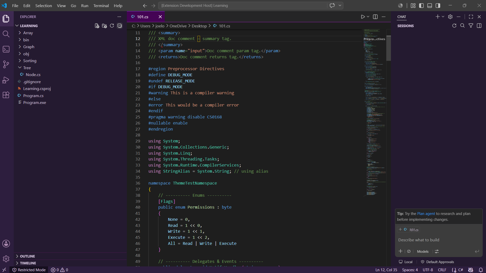

# Purple Knight Theme

A dark color theme for Visual Studio Code inspired by the classic **Visual Studio** IDE look — built on top of VS Code's own Dark+ syntax foundation, with the iconic Visual Studio purple (`#68217A`). Dedicated to all coders who are forced to code .NET in VS Code due to the cost of professional version of Visual Studio.



## Features

- **Faithful syntax highlighting** — classes, methods, interfaces, structs, enums, and namespaces are colored to match real Visual Studio conventions (teal classes, yellow methods, light green interfaces), tuned specifically for a clean C# development experience while remaining fully usable across other languages.
- **Signature purple chrome** — the Activity Bar, Side Bar, and Status Bar use deep purple tones drawn from Visual Studio's brand palette, instead of the flat grays/blues found in most default themes.
- **Purple accents throughout the workspace**:
  - A subtle purple highlight when dragging or resizing panels (sash hover)
  - A clean purple top-border on the active editor tab, with no distracting bottom border
  - Purple hover/active states on status bar items and clickable controls
- **Semantic highlighting enabled** — works with language servers (like the C# extension) to color classes, methods, and variables based on actual code meaning, not just pattern matching.

## Preview

| Area | Look |
|---|---|
| Activity Bar & Side Bar | Deep purple-black (`#2d1e3e` / `#241a30`) with lavender icons |
| Status Bar | Matches Activity Bar tone for a cohesive shell |
| Active Tab | Clean purple top accent, no bottom border |
| Editor | Neutral dark background so syntax colors stay legible and unclashing |

## Installation

1. Open **Extensions** in VS Code (`Ctrl+Shift+X` / `Cmd+Shift+X`).
2. Search for **Purple Knight Theme**.
3. Click **Install**.
4. Open the Command Palette (`Ctrl+Shift+P` / `Cmd+Shift+P`) → **Preferences: Color Theme** → select **Purple Knight Theme**.

Or install manually from a `.vsix` file:

```bash
code --install-extension purple-knight-theme-<version>.vsix
```

## Recommended settings

For the closest match to the intended look, especially around title bar theming:

```json
{
  "window.titleBarStyle": "custom",
  "editor.semanticHighlighting.enabled": true
}
```

## Requirements

No dependencies — this is a pure color theme with no bundled extensions or external requirements. For full C#-specific semantic coloring (classes/methods resolved by meaning rather than pattern), install the [C# extension](https://marketplace.visualstudio.com/items?itemName=ms-dotnettools.csharp) or **C# Dev Kit**.

## Known limitations

- VS Code's theming API doesn't support a full 4-sided border around a single, unsplit editor pane — the active tab uses a top-only accent border instead, the closest native equivalent.
- Tab-to-tab separator lines apply uniformly across all tabs; there's no way to style only the active tab's side borders differently through theme colors alone.

## Release Notes

### 1.0.0

- Initial release of Purple Knight Theme
- Full C#-aware syntax coloring (classes, interfaces, structs, enums, namespaces, methods)
- Purple-themed Activity Bar, Side Bar, and Status Bar
- Custom tab, sash, and drag-highlight accents

## Contributing

Found a scope that isn't colored right, or a UI element that should be more (or less) purple? Open an issue or PR on the repository — happy to keep refining this as more edge cases turn up.

## License

[MIT](LICENSE)

---

**Enjoy coding with a little more purple.**